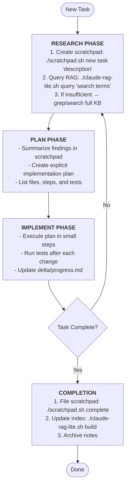

# LLM Agent Tools

A comprehensive toolkit for LLM agents to maintain persistent knowledge bases, manage temporary workspaces, and efficiently retrieve information using RAG (Retrieval-Augmented Generation).

## Features

- **Scratchpad System**: Temporary workspace management for agent notes and planning
- **RAG-based Knowledge Retrieval**: Fast SQLite FTS5 full-text search across knowledge base
- **Organized Knowledge Base**: Structured `.claude/` directory for persistent knowledge
- **Clear Workflow Phases**: Research → Plan → Implement cycle with proper tooling

## Installation

### Prerequisites
- Bash 4.0+
- Python 3.8+
- SQLite3 with FTS5 support
- `uv` package manager (for Python dependencies)

### Setup
```bash
# Clone the repository
git clone <repository-url>
cd llm-agent-tools

# Make scripts executable
chmod +x scratchpad.sh claude-rag-lite.sh

# Install Python dependencies
uv pip install -r pyproject.toml

# Initialize knowledge base structure
./scratchpad.sh new general "initial_setup"
```

## Core Tools

### 1. scratchpad.sh - Temporary Workspace Management

Manages temporary notes and working memory for AI agents during task execution.

**Commands:**
- `new [type] [description]` - Create new scratchpad (types: task, debug, plan, general)
- `list [filter]` - List active scratchpads
- `view <filename>` - View scratchpad content
- `edit <filename>` - Edit in default editor
- `append <filename> <text>` - Add text to existing scratchpad
- `complete <filename>` - Display filing instructions
- `filed <filename>` - Mark as filed and remove
- `archive <filename>` - Move to archive
- `search <term>` - Search all scratchpads

### 2. claude-rag-lite.sh - Knowledge Retrieval System

Fast full-text search using SQLite FTS5 for efficient knowledge base queries.

**Commands:**
- `build` - Build/update the search index
- `query <search-terms>` - Search the knowledge base
- `stats` - Display index statistics

### 3. Knowledge Base Structure (.claude/)

Organized directory structure for persistent knowledge storage:

```
.claude/
├── metadata/          # Component analysis, dependency info, system docs
├── code_index/        # Code relationships, function mappings, type hierarchies
├── debug_history/     # Debugging sessions, error fixes, troubleshooting
├── patterns/          # Implementation patterns, reusable solutions, best practices
├── qa/                # Questions answered, problems solved with explanations
├── cheatsheets/       # Quick references, common commands, shortcuts
├── delta/             # Change logs, updates, modifications to existing code
├── anchors/           # Important code locations to remember
└── scratchpad/        # Temporary working notes
    ├── active/        # Currently active scratchpads
    └── archive/       # Completed or old scratchpads
```

## Workflow



## Usage Examples

### Starting a New Task
```bash
# Create a task scratchpad
./scratchpad.sh new task "implement_user_auth"

# Search existing knowledge
./claude-rag-lite.sh query "authentication JWT tokens"

# Append findings to scratchpad
./scratchpad.sh append task_implement_user_auth_*.md "Found JWT implementation in patterns/"

# When complete, file the scratchpad
./scratchpad.sh complete task_implement_user_auth_*.md
./scratchpad.sh filed task_implement_user_auth_*.md
```

### Debugging Session
```bash
# Create debug scratchpad
./scratchpad.sh new debug "api_timeout_issue"

# Search for similar issues
./claude-rag-lite.sh query "timeout API connection error"

# Document solution
./scratchpad.sh append debug_api_timeout_*.md "Solution: Increased timeout to 30s"

# File to debug_history
./scratchpad.sh complete debug_api_timeout_*.md
```

### Planning a Feature
```bash
# Create planning scratchpad
./scratchpad.sh new plan "payment_integration"

# Research existing patterns
./claude-rag-lite.sh query "payment processing stripe"

# View and edit plan
./scratchpad.sh view plan_payment_integration_*.md
./scratchpad.sh edit plan_payment_integration_*.md
```

## Best Practices

### When to Use Each Tool

**Use scratchpad.sh when:**
- Starting any new task or investigation
- Debugging issues
- Planning implementations
- Taking temporary notes during research

**Use claude-rag-lite.sh when:**
- Searching for existing solutions or patterns
- Looking up previous debug sessions
- Finding code examples or implementations
- Checking if a problem has been solved before

### Knowledge Organization Guidelines

1. **Always start with a scratchpad** - Don't work directly in the knowledge base
2. **File completed work properly** - Use the `complete` command for filing guidance
3. **Keep the index updated** - Run `claude-rag-lite.sh build` after adding new documents
4. **Use descriptive filenames** - Include context in scratchpad descriptions
5. **Archive don't delete** - Move old scratchpads to archive instead of deleting

### Filing Guidelines by Directory

- **metadata/** - System architecture, component relationships, dependencies
- **code_index/** - Function signatures, class hierarchies, type definitions
- **debug_history/** - Specific bugs fixed with solutions and root causes
- **patterns/** - Reusable code patterns, design patterns, implementation templates
- **qa/** - Answered questions with full explanations and context
- **cheatsheets/** - Quick command references, shortcuts, common operations
- **delta/** - Chronological changes, updates, and modifications
- **anchors/** - Critical code locations, entry points, important files

## Advanced Features

### Custom Scratchpad Types
Extend scratchpad types by modifying the `create_scratchpad` function in `scratchpad.sh`.

### RAG Index Customization
Configure indexing behavior by modifying `rag_modules/indexer.py`:
- Adjust snippet length
- Modify file type filters
- Customize category detection

### Environment Variables
- `EDITOR` - Set default editor for scratchpad editing
- `CLAUDE_AGENT_ID` - Track agent identity in scratchpads
- `CLAUDE_DIR` - Override default `.claude` directory location

## Troubleshooting

### Common Issues

**Scratchpad not found:**
- Check active scratchpads: `./scratchpad.sh list`
- Use tab completion or partial filename matching

**RAG returns no results:**
- Rebuild index: `./claude-rag-lite.sh build`
- Check if documents exist in `.claude/` directories
- Try broader search terms

**SQLite FTS5 not available:**
- Ensure SQLite3 is compiled with FTS5 support
- Ubuntu/Debian: `apt install sqlite3`
- macOS: `brew install sqlite3`

## Contributing

1. Create feature scratchpad: `./scratchpad.sh new plan "feature_name"`
2. Document changes in `.claude/delta/`
3. Update relevant documentation in `.claude/patterns/` or `.claude/qa/`
4. Rebuild index after changes: `./claude-rag-lite.sh build`

## License

[Specify your license here]

## Acknowledgments

Built for efficient LLM agent workflows with emphasis on knowledge persistence and retrieval.