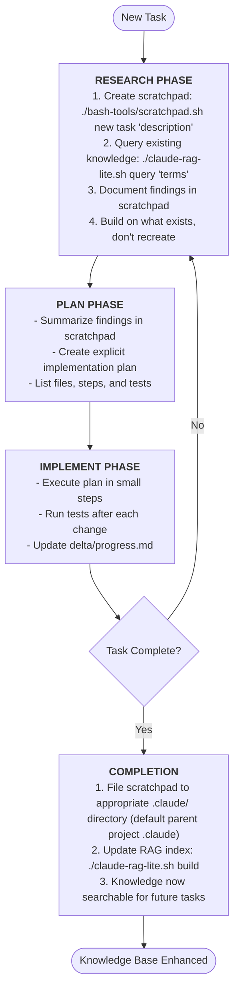
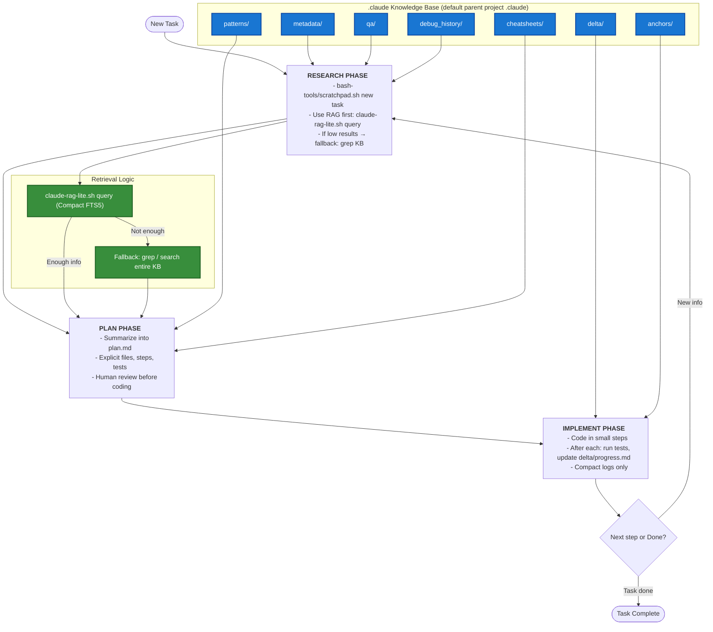

# LLM Agent Tools

An integrated toolkit for LLM agents that combines temporary workspace management with persistent knowledge retrieval. These tools work together to create a comprehensive workflow for maintaining context, building knowledge, and efficiently accessing information through RAG (Retrieval-Augmented Generation).

## Features

- **Integrated Workflow**: Tools designed to work together, not in isolation
- **Scratchpad + RAG Synergy**: Temporary notes flow into searchable knowledge base
- **Persistent Knowledge Building**: Every task contributes to growing knowledge base
- **Fast Retrieval**: SQLite FTS5 enables instant access to all past work
- **Structured Organization**: Clear pipeline from temporary work to permanent knowledge
- **Project Optimization**: `prompt.md` template for ongoing large projects with established document knowledge bases to make repositories Claude/LLM-friendly

## Installation

### Quick Install

```bash
# Clone the repository
git clone https://github.com/yourusername/llm-agent-tools.git
cd llm-agent-tools

# IMPORTANT: Remove git history to avoid submodule issues
rm -rf .git

# Run the installer
./install.sh
```

The installer will:
- Check all dependencies (Bash 4.0+, Python 3.8+, SQLite3 with FTS5)
- Detect any existing `.claude` directories
- Offer safe installation options if conflicts exist
- Set up the complete knowledge base structure
- Install Python dependencies if `uv` is available

### Zero-Config Quick Start (Recommended)

- After cloning, you can run the tools immediately — no config needed.
- By default, tools use the parent project's `.claude` directory.
- When cloned into `example/llm-agent-tools/`, tools use `example/.claude/`.
- Scratchpads live under `example/.claude/scratchpad/active/` until you file them.

```bash
# Create task scaffolding (research/plan/implement pads)
./bash-tools/scratchpad.sh scaffold my_feature

# Work and file notes into your KB categories
./bash-tools/scratchpad.sh fileto plan_my_feature.md patterns my_feature_plan

# Build the RAG index and search
./claude-rag-lite.sh build
./claude-rag-lite.sh query "my_feature" 10 text
```

### Installation Options

The installer handles various scenarios intelligently:

1. **Fresh Installation** - If no `.claude` directory exists, creates the full structure
2. **Safe Merge** - If `.claude` exists, only adds missing directories without overwriting
3. **Alternative Directory** - If you have Claude Desktop's `.claude`, uses `.llm-agent-tools` instead
4. **Backup & Replace** - Creates a timestamped backup before fresh installation

### Manual Setup

If you prefer manual installation:

```bash
# Clone the repository
git clone https://github.com/yourusername/llm-agent-tools.git
cd llm-agent-tools

# IMPORTANT: Remove git history to avoid submodule issues
rm -rf .git

# Make scripts executable
chmod +x bash-tools/scratchpad.sh claude-rag-lite.sh

# Install Python dependencies
uv pip install -r pyproject.toml

# Initialize knowledge base structure (auto-creates parent project .claude if missing)
./bash-tools/scratchpad.sh new general "initial_setup"
```

### Custom Directory Configuration

You can use a custom directory instead of `.claude`:

```bash
# Using environment variable (optional — defaults to parent project .claude)
export CLAUDE_DIR="/path/to/your/knowledge/base"
./bash-tools/scratchpad.sh new task "my_task"

# Using configuration file
cp .llm-tools.conf.example .llm-tools.conf
# Edit .llm-tools.conf to set your custom paths
```

### Prerequisites

- **Bash 4.0+** - Required for array support and modern bash features
- **Python 3.8+** - Required for RAG indexing and search
- **SQLite3 with FTS5** - Required for full-text search capabilities
- **uv** (recommended) - Fast Python package manager (installer will prompt if missing)

Install missing dependencies:
```bash
# Ubuntu/Debian
sudo apt-get update && sudo apt-get install -y sqlite3 libsqlite3-dev python3 python3-pip

# macOS
brew install sqlite3 python3

# Install uv (recommended)
curl -LsSf https://astral.sh/uv/install.sh | sh
```

### Uninstalling

To remove LLM Agent Tools:
```bash
./uninstall.sh
```

The uninstaller will:
- Preserve your knowledge base by default
- Offer to create a backup before removal
- Clean up only files installed by the installer

## Core Tools

### 1. prompt.md - Repository Optimizer for Ongoing Projects

A specialized template for large, ongoing projects with established document knowledge bases. This prompt helps make repositories Claude/LLM-friendly by:
- Setting a baseline for the current state of the project
- Crawling git history, PRs, issues, and releases to build comprehensive metadata
- Creating and maintaining `.claude/` directory structure with proper categorization
- Generating anchor IDs for important code locations
- Building idempotent scripts to keep the knowledge base updated

Use `prompt.md` when you need to optimize an existing repository for LLM interaction and maintain its knowledge base over time.

### 2. scratchpad.sh - Temporary Workspace Management

Manages temporary notes and working memory for AI agents during task execution.

**Commands:**
- `new [type] [description]` – Create scratchpad (types: task, debug, plan, general)
- `list [filter]` – List active scratchpads
- `view <filename>` – View scratchpad content
- `edit <filename>` – Edit in default editor
- `append <filename> <text>` – Add text to existing scratchpad
- `complete <filename>` – Display filing instructions
- `filed <filename>` – Mark as filed and remove
- `archive <filename>` – Move to archive
- `search <term>` – Search all scratchpads
- `scaffold <task_name>` – Create research/plan/implement files from templates
- `fileto <filename> <dir> [new_name]` – Move an active pad into `.claude/<dir>/`
- `delta <title> [summary]` – Create a timestamped change log in `.claude/delta/`

Notes:
- By default, files are created under the parent project's `.claude` directory. Override with `CLAUDE_DIR` if desired.
- A legacy wrapper `./scratchpad.sh` forwards to `./bash-tools/scratchpad.sh`.

### 3. claude-rag-lite.sh - Knowledge Retrieval System

Fast full-text search using SQLite FTS5 for efficient knowledge base queries.

**Commands:**
- `build` - Build/update the search index
- `query <search-terms>` - Search the knowledge base
- `stats` - Display index statistics

### 4. Knowledge Base Structure (.claude/)

Organized directory structure for persistent knowledge storage:

```
.claude/
├── metadata/          # Component analysis, dependency info, system docs
├── code_index/        # Code relationships, function mappings, type hierarchies
├── debug_history/     # Debugging sessions, error fixes, troubleshooting
├── patterns/          # Implementation patterns, reusable solutions, best practices
├── qa/                # Questions answered, problems solved with explanations
├── cheatsheets/       # Quick references, common commands, shortcuts
├── delta/             # Change logs, updates, modifications to existing code
├── anchors/           # Important code locations to remember

```

## Integrated Workflow

The tools work together in a continuous cycle where each task builds on previous knowledge:



## Standardized Flow (Research → Plan → Implement)

Use the provided templates and helper commands to keep every task consistent and searchable.

1) Scaffold task files

```bash
./bash-tools/scratchpad.sh scaffold my_feature
# Creates in .claude/scratchpad/active/:
#   research_my_feature.md, plan_my_feature.md, implement_my_feature.md
```

2) Research
- Run RAG and local search to gather prior work.
- Record findings and gaps in `research_<task>.md`.

```bash
./claude-rag-lite.sh query "<term>"    # If uv is available
# Fallback (no-uv environments):
CLAUDE_DIR="${CLAUDE_DIR:-$(dirname "$(pwd)")/.claude}" \
python3 rag_modules/search.py \
  --db-path "${CLAUDE_DIR}/.rag/claude_knowledge.db" \
  --query "<term>" --format text
```

3) Plan
- Write explicit steps and acceptance criteria in `plan_<task>.md`.

4) Implement
- Make incremental changes and log them in `implement_<task>.md`.

5) File knowledge and change logs
- Move final notes into the right knowledge folders using `fileto`.

```bash
# Examples
./bash-tools/scratchpad.sh fileto research_my_feature.md metadata
./bash-tools/scratchpad.sh fileto plan_my_feature.md patterns "my_feature_plan"
./bash-tools/scratchpad.sh delta "My Feature" "context or short summary here"
```

6) Rebuild index and validate
- Update the FTS5 index so new docs are searchable.

```bash
# Preferred (if uv works in your environment):
./claude-rag-lite.sh build

# Fallback without uv:
CLAUDE_DIR="${CLAUDE_DIR:-$(dirname "$(pwd)")/.claude}" \
python3 rag_modules/indexer.py \
  --claude-dir "${CLAUDE_DIR}" \
  --db-path "${CLAUDE_DIR}/.rag/claude_knowledge.db" \
  --incremental
```

7) Search to confirm

```bash
./claude-rag-lite.sh query "my_feature" 5 || \
CLAUDE_DIR="${CLAUDE_DIR:-$(dirname "$(pwd)")/.claude}" \
python3 rag_modules/search.py --db-path "${CLAUDE_DIR}/.rag/claude_knowledge.db" --query "my_feature" --format text
```

## Usage Examples

### Starting a New Task (Integrated Workflow)
```bash
# Step 1: Create workspace AND search existing knowledge simultaneously
./bash-tools/scratchpad.sh new task "implement_user_auth"
./claude-rag-lite.sh query "authentication JWT tokens user auth"

# Step 2: Build on existing knowledge, document in scratchpad
./bash-tools/scratchpad.sh append task_implement_user_auth_*.md "Found JWT pattern in patterns/jwt_auth.md"
./bash-tools/scratchpad.sh append task_implement_user_auth_*.md "Previous auth debug in debug_history/auth_fix.md"

# Step 3: Continue working, searching, and documenting
./claude-rag-lite.sh query "session management"
./bash-tools/scratchpad.sh append task_implement_user_auth_*.md "Implemented using existing session pattern"

# Step 4: Complete cycle - file knowledge and update index
./bash-tools/scratchpad.sh complete task_implement_user_auth_*.md
./bash-tools/scratchpad.sh filed task_implement_user_auth_*.md
./claude-rag-lite.sh build  # New knowledge now searchable
```

### Debugging Session (Building on Past Solutions)
```bash
# Step 1: Start debugging WITH knowledge search
./bash-tools/scratchpad.sh new debug "api_timeout_issue"
./claude-rag-lite.sh query "timeout API connection error"  # Check if solved before

# Step 2: Found similar issue - build on it
./bash-tools/scratchpad.sh append debug_api_timeout_*.md "Similar issue in debug_history/timeout_2024.md"
./bash-tools/scratchpad.sh append debug_api_timeout_*.md "Previous solution: 30s timeout, but this needs 45s"

# Step 3: Document complete solution for future
./bash-tools/scratchpad.sh append debug_api_timeout_*.md "Root cause: Large payload processing"
./bash-tools/scratchpad.sh complete debug_api_timeout_*.md
./claude-rag-lite.sh build  # Future debugging can find this
```

### Planning a Feature (Leveraging All Knowledge)
```bash
# Step 1: Plan WITH comprehensive knowledge search
./bash-tools/scratchpad.sh new plan "payment_integration"
./claude-rag-lite.sh query "payment stripe webhook"  # Check existing implementations
./claude-rag-lite.sh query "error handling retry"    # Check patterns
./claude-rag-lite.sh query "payment"                 # Broad search for any related work

# Step 2: Build plan incorporating all findings
./bash-tools/scratchpad.sh append plan_payment_*.md "Found Stripe webhook pattern in patterns/webhook.md"
./bash-tools/scratchpad.sh append plan_payment_*.md "Retry logic from patterns/retry_strategy.md"
./bash-tools/scratchpad.sh append plan_payment_*.md "Previous payment debug in debug_history/payment_fix.md"

# Step 3: Complete planning phase
./bash-tools/scratchpad.sh complete plan_payment_*.md
./claude-rag-lite.sh build  # Plan becomes searchable knowledge
```

## Best Practices

### How Tools Work Together

**Integrated Usage Pattern:**
1. **Always start with both tools:**
   - Create scratchpad for current work: `./bash-tools/scratchpad.sh new`
   - Query existing knowledge: `./claude-rag-lite.sh query`
   - Append findings to scratchpad as you work

2. **During work:**
   - Continuously search RAG for relevant patterns/solutions
   - Document discoveries in active scratchpad
   - Cross-reference with existing knowledge

3. **After completion:**
   - File scratchpad to appropriate directory
   - Rebuild RAG index to include new knowledge
   - Future tasks can now build on this work

### Knowledge Building Guidelines

1. **Start with BOTH tools** - Create scratchpad AND search existing knowledge
2. **Build on what exists** - Never recreate solutions, extend them
3. **Document connections** - Note which existing docs helped solve current task
4. **Close the loop** - Always file scratchpad and rebuild index
5. **Think long-term** - Today's scratchpad is tomorrow's searchable solution
6. **Cross-reference liberally** - Link related knowledge in your notes

### Filing Guidelines by Directory

- **metadata/** - System architecture, component relationships, dependencies
- **code_index/** - Function signatures, class hierarchies, type definitions
- **debug_history/** - Specific bugs fixed with solutions and root causes
- **patterns/** - Reusable code patterns, design patterns, implementation templates
- **qa/** - Answered questions with full explanations and context
- **cheatsheets/** - Quick command references, shortcuts, common operations
- **delta/** - Chronological changes, updates, and modifications
- **anchors/** - Critical code locations, entry points, important files

## Directory Resolution

### Project-Based Knowledge Isolation

Both `scratchpad.sh` and `claude-rag-lite.sh` now use **parent project directory resolution** for better project isolation:

```
example/                    # Your project root
├── .claude/               # Knowledge base (tools use this)
├── llm-agent-tools/       # This repository
│   ├── bash-tools/
│   ├── rag_modules/
│   ├── scratchpad.sh
│   └── claude-rag-lite.sh
└── your-code/
```

When cloned into `example/llm-agent-tools/`:
- Tools automatically use `example/.claude/` (parent directory)
- Scratchpads file to `example/.claude/categories/`
- RAG indexes `example/.claude/` content
- Maintains project knowledge isolation

### Override Behavior

You can still use custom locations via:
```bash
export CLAUDE_DIR="/path/to/custom/kb"
```

## Advanced Features

### Custom Scratchpad Types
Extend scratchpad types by modifying the `create_scratchpad` function in `bash-tools/scratchpad.sh`.

Default knowledge base location
- Priority when choosing `.claude/` for both scratchpad and RAG:
  1) `CLAUDE_DIR` env var or `.llm-tools.conf` setting
  2) Parent project `.claude` directory (e.g., `example/.claude` when cloned to `example/llm-agent-tools/`)
  3) Created automatically if missing

To use a custom KB location, set `CLAUDE_DIR`:
```
export CLAUDE_DIR="/path/to/your/knowledge/base"
```

### RAG Index Customization
Configure indexing behavior by modifying `rag_modules/indexer.py`:
- Adjust snippet length
- Modify file type filters
- Customize category detection

### Environment Variables
- `EDITOR` - Set default editor for scratchpad editing
- `CLAUDE_AGENT_ID` - Track agent identity in scratchpads
- `CLAUDE_DIR` - Override default `.claude` directory location

## Troubleshooting

### Common Issues

**Scratchpad not found:**
- Check active scratchpads: `./bash-tools/scratchpad.sh list`
- Use tab completion or partial filename matching

**RAG returns no results:**
- Rebuild index: `./claude-rag-lite.sh build`
- Check if documents exist in `.claude/` directories
- Try broader search terms

**SQLite FTS5 not available:**
- Ensure SQLite3 is compiled with FTS5 support
- Ubuntu/Debian: `apt install sqlite3`
- macOS: `brew install sqlite3`

## Workflow Diagram



 
