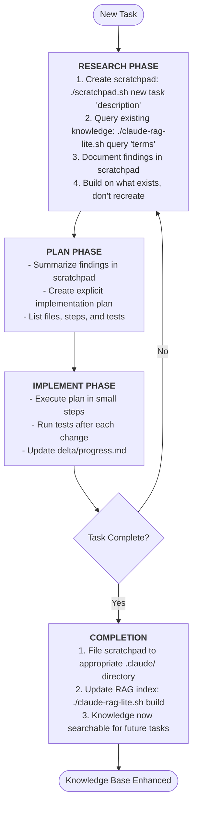
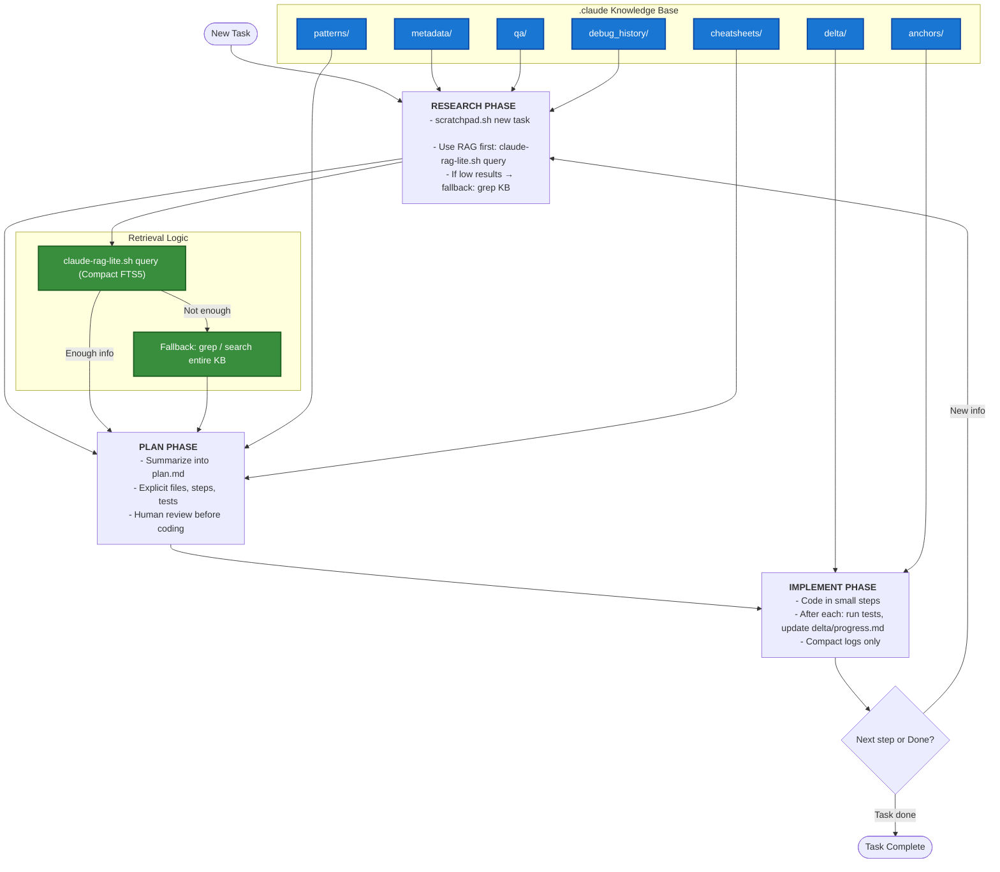

# LLM Agent Tools

An integrated toolkit for LLM agents that combines temporary workspace management with persistent knowledge retrieval. These tools work together to create a comprehensive workflow for maintaining context, building knowledge, and efficiently accessing information through RAG (Retrieval-Augmented Generation).

## Features

- **Integrated Workflow**: Tools designed to work together, not in isolation
- **Scratchpad + RAG Synergy**: Temporary notes flow into searchable knowledge base
- **Persistent Knowledge Building**: Every task contributes to growing knowledge base
- **Fast Retrieval**: SQLite FTS5 enables instant access to all past work
- **Structured Organization**: Clear pipeline from temporary work to permanent knowledge

## Installation

### Prerequisites
- Bash 4.0+
- Python 3.8+
- SQLite3 with FTS5 support
- `uv` package manager (for Python dependencies)

### Setup
```bash
# Clone the repository
git clone <repository-url>
cd llm-agent-tools

# Make scripts executable
chmod +x scratchpad.sh claude-rag-lite.sh

# Install Python dependencies
uv pip install -r pyproject.toml

# Initialize knowledge base structure
./scratchpad.sh new general "initial_setup"
```

## Core Tools

### 1. scratchpad.sh - Temporary Workspace Management

Manages temporary notes and working memory for AI agents during task execution.

**Commands:**
- `new [type] [description]` – Create scratchpad (types: task, debug, plan, general)
- `list [filter]` – List active scratchpads
- `view <filename>` – View scratchpad content
- `edit <filename>` – Edit in default editor
- `append <filename> <text>` – Add text to existing scratchpad
- `complete <filename>` – Display filing instructions
- `filed <filename>` – Mark as filed and remove
- `archive <filename>` – Move to archive
- `search <term>` – Search all scratchpads
- `scaffold <task_name>` – Create research/plan/implement files from templates
- `fileto <filename> <dir> [new_name]` – Move an active pad into `.claude/<dir>/`
- `delta <title> [summary]` – Create a timestamped change log in `.claude/delta/`

### 2. claude-rag-lite.sh - Knowledge Retrieval System

Fast full-text search using SQLite FTS5 for efficient knowledge base queries.

**Commands:**
- `build` - Build/update the search index
- `query <search-terms>` - Search the knowledge base
- `stats` - Display index statistics

### 3. Knowledge Base Structure (.claude/)

Organized directory structure for persistent knowledge storage:

```
.claude/
├── metadata/          # Component analysis, dependency info, system docs
├── code_index/        # Code relationships, function mappings, type hierarchies
├── debug_history/     # Debugging sessions, error fixes, troubleshooting
├── patterns/          # Implementation patterns, reusable solutions, best practices
├── qa/                # Questions answered, problems solved with explanations
├── cheatsheets/       # Quick references, common commands, shortcuts
├── delta/             # Change logs, updates, modifications to existing code
├── anchors/           # Important code locations to remember
└── scratchpad/        # Temporary working notes
    ├── active/        # Currently active scratchpads
    └── archive/       # Completed or old scratchpads
```

## Integrated Workflow

The tools work together in a continuous cycle where each task builds on previous knowledge:



## Standardized Flow (Research → Plan → Implement)

Use the provided templates and helper commands to keep every task consistent and searchable.

1) Scaffold task files

```bash
./scratchpad.sh scaffold my_feature
# Creates in .claude/scratchpad/active/:
#   research_my_feature.md, plan_my_feature.md, implement_my_feature.md
```

2) Research
- Run RAG and local search to gather prior work.
- Record findings and gaps in `research_<task>.md`.

```bash
./claude-rag-lite.sh query "<term>"    # If uv is available
# Fallback (no-uv environments):
python3 rag_modules/search.py --db-path .claude/.rag/claude_knowledge.db --query "<term>" --format text
```

3) Plan
- Write explicit steps and acceptance criteria in `plan_<task>.md`.

4) Implement
- Make incremental changes and log them in `implement_<task>.md`.

5) File knowledge and change logs
- Move final notes into the right knowledge folders using `fileto`.

```bash
# Examples
./scratchpad.sh fileto research_my_feature.md metadata
./scratchpad.sh fileto plan_my_feature.md patterns "my_feature_plan"
./scratchpad.sh delta "My Feature" "context or short summary here"
```

6) Rebuild index and validate
- Update the FTS5 index so new docs are searchable.

```bash
# Preferred (if uv works in your environment):
./claude-rag-lite.sh build

# Fallback without uv:
python3 rag_modules/indexer.py \
  --claude-dir .claude \
  --db-path .claude/.rag/claude_knowledge.db \
  --incremental
```

7) Search to confirm

```bash
./claude-rag-lite.sh query "my_feature" 5 || \
python3 rag_modules/search.py --db-path .claude/.rag/claude_knowledge.db --query "my_feature" --format text
```

## Usage Examples

### Starting a New Task (Integrated Workflow)
```bash
# Step 1: Create workspace AND search existing knowledge simultaneously
./scratchpad.sh new task "implement_user_auth"
./claude-rag-lite.sh query "authentication JWT tokens user auth"

# Step 2: Build on existing knowledge, document in scratchpad
./scratchpad.sh append task_implement_user_auth_*.md "Found JWT pattern in patterns/jwt_auth.md"
./scratchpad.sh append task_implement_user_auth_*.md "Previous auth debug in debug_history/auth_fix.md"

# Step 3: Continue working, searching, and documenting
./claude-rag-lite.sh query "session management"
./scratchpad.sh append task_implement_user_auth_*.md "Implemented using existing session pattern"

# Step 4: Complete cycle - file knowledge and update index
./scratchpad.sh complete task_implement_user_auth_*.md
./scratchpad.sh filed task_implement_user_auth_*.md
./claude-rag-lite.sh build  # New knowledge now searchable
```

### Debugging Session (Building on Past Solutions)
```bash
# Step 1: Start debugging WITH knowledge search
./scratchpad.sh new debug "api_timeout_issue"
./claude-rag-lite.sh query "timeout API connection error"  # Check if solved before

# Step 2: Found similar issue - build on it
./scratchpad.sh append debug_api_timeout_*.md "Similar issue in debug_history/timeout_2024.md"
./scratchpad.sh append debug_api_timeout_*.md "Previous solution: 30s timeout, but this needs 45s"

# Step 3: Document complete solution for future
./scratchpad.sh append debug_api_timeout_*.md "Root cause: Large payload processing"
./scratchpad.sh complete debug_api_timeout_*.md
./claude-rag-lite.sh build  # Future debugging can find this
```

### Planning a Feature (Leveraging All Knowledge)
```bash
# Step 1: Plan WITH comprehensive knowledge search
./scratchpad.sh new plan "payment_integration"
./claude-rag-lite.sh query "payment stripe webhook"  # Check existing implementations
./claude-rag-lite.sh query "error handling retry"    # Check patterns
./claude-rag-lite.sh query "payment"                 # Broad search for any related work

# Step 2: Build plan incorporating all findings
./scratchpad.sh append plan_payment_*.md "Found Stripe webhook pattern in patterns/webhook.md"
./scratchpad.sh append plan_payment_*.md "Retry logic from patterns/retry_strategy.md"
./scratchpad.sh append plan_payment_*.md "Previous payment debug in debug_history/payment_fix.md"

# Step 3: Complete planning phase
./scratchpad.sh complete plan_payment_*.md
./claude-rag-lite.sh build  # Plan becomes searchable knowledge
```

## Best Practices

### How Tools Work Together

**Integrated Usage Pattern:**
1. **Always start with both tools:**
   - Create scratchpad for current work: `./scratchpad.sh new`
   - Query existing knowledge: `./claude-rag-lite.sh query`
   - Append findings to scratchpad as you work

2. **During work:**
   - Continuously search RAG for relevant patterns/solutions
   - Document discoveries in active scratchpad
   - Cross-reference with existing knowledge

3. **After completion:**
   - File scratchpad to appropriate directory
   - Rebuild RAG index to include new knowledge
   - Future tasks can now build on this work

### Knowledge Building Guidelines

1. **Start with BOTH tools** - Create scratchpad AND search existing knowledge
2. **Build on what exists** - Never recreate solutions, extend them
3. **Document connections** - Note which existing docs helped solve current task
4. **Close the loop** - Always file scratchpad and rebuild index
5. **Think long-term** - Today's scratchpad is tomorrow's searchable solution
6. **Cross-reference liberally** - Link related knowledge in your notes

### Filing Guidelines by Directory

- **metadata/** - System architecture, component relationships, dependencies
- **code_index/** - Function signatures, class hierarchies, type definitions
- **debug_history/** - Specific bugs fixed with solutions and root causes
- **patterns/** - Reusable code patterns, design patterns, implementation templates
- **qa/** - Answered questions with full explanations and context
- **cheatsheets/** - Quick command references, shortcuts, common operations
- **delta/** - Chronological changes, updates, and modifications
- **anchors/** - Critical code locations, entry points, important files

## Advanced Features

### Custom Scratchpad Types
Extend scratchpad types by modifying the `create_scratchpad` function in `scratchpad.sh`.

### RAG Index Customization
Configure indexing behavior by modifying `rag_modules/indexer.py`:
- Adjust snippet length
- Modify file type filters
- Customize category detection

### Environment Variables
- `EDITOR` - Set default editor for scratchpad editing
- `CLAUDE_AGENT_ID` - Track agent identity in scratchpads
- `CLAUDE_DIR` - Override default `.claude` directory location

## Troubleshooting

### Common Issues

**Scratchpad not found:**
- Check active scratchpads: `./scratchpad.sh list`
- Use tab completion or partial filename matching

**RAG returns no results:**
- Rebuild index: `./claude-rag-lite.sh build`
- Check if documents exist in `.claude/` directories
- Try broader search terms

**SQLite FTS5 not available:**
- Ensure SQLite3 is compiled with FTS5 support
- Ubuntu/Debian: `apt install sqlite3`
- macOS: `brew install sqlite3`

## Workflow Diagram



 
