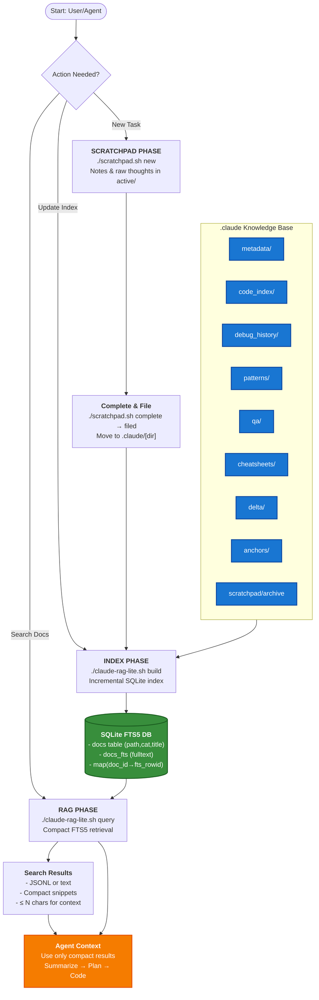

Here’s a **Mermaid flowchart** version for the new **Bash + Python (SQLite FTS5) RAG system** integrated into your existing `.claude/` workflow.

---

### How to Use the Chart

1. **Scratchpad Phase** → Take notes as usual, file them into `.claude/` when ready.
2. **Index Phase** → `./claude-rag-lite.sh build` keeps SQLite FTS5 index updated incrementally.
3. **Search Phase** → `./claude-rag-lite.sh query "term"` returns compact JSON/text snippets for clean context injection.
4. **Agent Context** → Agent only sees **compacted info**, not raw full files, keeping the prompt window clean.

---
